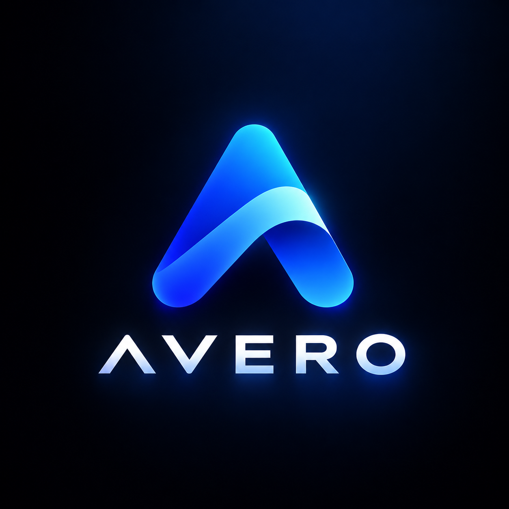

<p align="center">
  
</p>

<h1 align="center">AVERO STUDIO</h1>

<p align="center">
  <strong>Professional photo studio v2.0.0</strong><br/>
  Open source raster editor untuk Linux dan Windows. Offline, non destruktif, ringan RAM via tiled pipeline.
</p>

<p align="center">
  
  
  
  
  
</p>

---

## Daftar Isi

- [Ringkasan](#ringkasan)
- [Tampilan](#tampilan)
- [Fitur Utama](#fitur-utama)
- [Engine C C++ Rust TypeScript](#engine-c-c-rust-typescript)
- [Tools Editing Lengkap 60](#tools-editing-lengkap-60)
- [Shortcut Universal](#shortcut-universal)
- [Format Proyek .avx](#format-proyek-avx)
- [Export Multi Format](#export-multi-format)
- [Tech Stack](#tech-stack)
- [Arsitektur](#arsitektur)
- [Performa Ringan RAM](#performa-ringan-ram)
- [Instalasi dan Development](#instalasi-dan-development)
- [Build Installer dan Portable](#build-installer-dan-portable)
- [Struktur Proyek](#struktur-proyek)
- [Script](#script)
- [Kontribusi](#kontribusi)
- [Lisensi](#lisensi)

---

## Ringkasan

AVERO STUDIO adalah editor foto raster profesional berbasis desktop. Dibangun dengan Tauri v2, frontend React 19 + TypeScript + Tailwind v4, backend Rust, serta engine native C dan C++ yang di FFI ke Rust. Semua berjalan offline tanpa akun. Dokumen disimpan utuh sebagai `.avx` dan dapat diekspor ke PNG, JPG, WEBP, BMP, TIFF, SVG.

Fokus utama: layer dan mask non destruktif, adjustment dan filter stack, color management, RAW develop, serta pipeline tiled yang hemat RAM untuk dokumen besar hingga 16K.

---

## Tampilan

### Loading Full Size

- Background penuh memakai `public/img/1.jpg` dan `public/img/2.jpg` side by side, overlay gradient `from-black/60 to-black/75` dan grid halus 48px.
- Logo asli `public/logo.png` di pojok kanan atas dalam pill `border-white/15 bg-black/45 backdrop-blur-md`.
- Teks dan loading bar di kiri: badge `MEMUAT EDITOR`, judul `AVERO STUDIO`, deskripsi, card modul dengan dot indikator, bar `h-2` dengan shimmer `avero-shimmer`, tips rotasi, dan bottom bar penuh.

### Homescreen Studio

- Header 56px `bg-[#1c1c1f]/90 backdrop-blur` dengan search pill 360px, tombol `Proyek .avx`, `Baru` primary, `Buka` putih.
- Sidebar 200px kategori preset Foto/Print/Art/Web/Mobile/Film dengan icon dan count, serta card `Proyek .avx` gradient.
- Hero dengan `img/1.jpg opacity 0.08` dan gradient, tombol `Buat dokumen`, `Buka gambar`, `Buka .avx`.
- Grid `Terbaru` 2/3/4/5 kolom card `rounded-xl hover:-translate-y-0.5 shadow`, thumb 140px dengan overlay, dan `Preset` dengan preview aspect `(w/max)*130`.
- Panel `Pelajari dalam 1 menit` 6 card dengan icon.

### Editor Studio

- TitleBar sticky `backdrop-blur` dengan menu File/Edit/Image/Layer/Select/Filter/Adjust/View/Help pill `rounded-full`, search `Ctrl+K`, dan status `C 2.0.0 � C++ 2.0.0 � Rust 0.1.0`.
- WorkspaceBar pill `Retouch/Photo/Design/Minimal` dengan icon.
- QuickExportBar di atas canvas: tombol `.avx` primary + dropdown Simpan/Simpan Sebagai/Buka, tombol `Export` + 6 format cepat `PNG/JPG/WEBP/BMP/TIFF/SVG`, info `WxH � belum/tersimpan`.
- ToolBar kiri `w-[56px]` 60 tools dalam 5 grup `Pilih/Retouch/Cat/Vektor/Navigasi` scrollable, dot aktif `bg-[#8fb6f5]`.
- RightPanel 300px tab dengan icon `Layers/Select/Mask/Adjust/Filter/Lab/Text/Color/RAW...` dan badge count untuk Adjust/Filter/History.
- Canvas tengah dengan checkerboard transparansi dan shadow, rulers dan guides dapat toggle.

---

## Fitur Utama

- **Layer dan Mask**: blend mode normal/multiply/screen/overlay/darken/lighten/difference, opacity, lock, clip, feather, density, mask paint via Brush/Eraser.
- **Selection Presisi**: rect/ellipse, single row/column, lasso/polygon, quick select, magic wand, feather, inverse, color range, subject, select and mask, crop dan frame.
- **Retouch Lengkap**: spot heal, healing brush, patch, content-aware move, red eye, clone stamp dengan Alt+klik sumber, blur/sharpen/smudge, dodge/burn/sponge, liquify/warp, pencill dan mixer brush.
- **Adjustment Non Destruktif JS**: brightness/contrast, levels, curves, exposure, HSL, vibrance, color balance, selective color, shadows/highlights, photo filter, channel mixer, gradient map, LUT, black/white, invert, threshold, posterize. Stack dapat reorder, toggle, opacity.
- **Filter Non Destruktif JS**: gaussian/box/motion blur, sharpen/unsharp/high pass, denoise/noise/grain, vignette, tiltShift, halftone, oilPaint, chroma, pixelate, emboss, findEdges.
- **Native Engine C/C++**: 23 ops C dan 23 filter C++ yang sangat ringan RAM, dipanggil via Rust FFI. Lihat bagian engine.
- **Color dan RAW**: working space sRGB/AdobeRGB/ProPhoto, bit depth 8/16, soft proof CMYK, RAW develop exposure/temperature/tint/highlights/shadows.
- **Proyek .avx Utuh**: simpan seluruh dokumen ke JSON `AVX1` dan buka kembali 100% sama termasuk thumb untuk recent.
- **Export Fleksibel**: PNG lossless, JPG/JPEG dengan quality dan matte, WEBP modern, BMP tanpa kompresi, TIFF cetak, SVG pembungkus raster.
- **Interaktif Studio**: hover translate, drag file ke canvas, command palette `Ctrl+K`, onboarding 5 langkah, autosave recovery tiap 2 menit, recent dengan thumb.

---

## Engine C C++ Rust TypeScript

### C Core v2 - 23 Ops Ringan RAM `src-tauri/native/image_ops.h`

In place RGBA8, len harus kelipatan 4. Hanya butuh LUT 256 atau histogram 1KB, tanpa duplikat gambar.

- Basis 6: `gray` (Rec.709), `invert`, `brightness` (-100..100), `contrast` (factor), `threshold` (0..255), `desaturate` (0..100).
- Lanjut 12: `exposure` (EV -6..6 pow2), `gamma` (0.1..4 LUT), `vibrance` (boost saturasi rendah), `warmth` (-100..100), `posterize` (2..32), `sepia` (0..100), `colorBalance` (cr/mg/yb), `shadowsHighlights` (-100..100), `hueShift` (derajat, HSL), `autoLevels` (stretch per channel), `autoContrast` (stretch luma), `opacity` (0..100).
- Advance ringan 5: `equalize` (cdf), `dither_floyd` (2 row error), `noise_mono` (LCG), `channel_swap` (6 permutasi), `alpha_premultiply`.

Semua fungsi `avero_c_*` di `image_ops.c` memakai `clamp_u8` dan loop `i+=4`, build dengan `cc -O3` di `build.rs`.

### C++ Filters v2 - 23 Filters Tiled `src-tauri/native/filters.hpp`

Wrapper `extern "C"` agar link stabil dari Rust. Dua pass src->dst.

- Basis 16: `box_blur` separable, `sharpen` kernel 3x3, `unsharp` (box + mask), `emboss`, `motion_blur` (angle), `gaussian` (sigma, kernel 3*sigma), `median` (nth_element), `sobel`, `vignette` (radial), `chroma` (geser R/B), `grain` (mt19937), `halftone` (dot), `tilt_shift` (focusY/H), `oil_paint` (kuantisasi), `find_edges` (invert sobel), `pixelate`.
- Ringan tiled 4: `box_blur_light`, `gaussian_light`, `bilateral_light` (edge preserving, radius 1..4, sigma 5..100), `unsharp_light`. Tile 512, overhead hanya 2 scanline buffer (<64KB) dibanding full duplicate `w*h*4`. Untuk 8K 8192x5464: Full ~537MB, Light ~273MB hemat ~264MB.
- Morfologi dan distorsi: `minimize` dan `maximize` (radius 1..8) untuk bersihkan noda, `swirl` (pusat dokumen, radius dan kekuatan derajat, interpolasi bilinear).

### Rust Orchestrator `src-tauri/src/native.rs`

- `extern "C"` FFI ke C dan C++, helper `cstr_to_string`, `check_rgba`, `check_wh`.
- Enum `NativeOp` 23 varian dan `NativeFilterOp` 23 varian dengan `serde(renameAll="camelCase")` dan `allow(non_snake_case)` untuk `hueDeg/focusY`.
- Command: `cmd_native_info` (versi C 2.0.0, C++ 2.0.0, Rust 0.1.0, features), `cmd_native_apply_op` (in place), `cmd_native_apply_filter` (dua pass), `cmd_native_histogram` (rayon fold+reduce 256 bins), `cmd_native_stats` (mean/std/min/max rayon), `cmd_native_pipeline` (ops C lalu filter C++ ping-pong 2 buffer), `cmd_native_pipeline_light` (remap ke light), `cmd_native_memory_budget` (per layer, total, light saving, rekomendasi), `cmd_native_benchmark` (MP/s).
- Pipeline hemat RAM: hanya 2 `Vec<u8>` ping-pong, tidak ada alokasi per filter selain dst. Tile pipeline di TS memecah canvas besar jadi tile 512 dan yield tiap 8 tile.

### TypeScript Bridge `src/io/nativeEngine.ts`

- Type `NativeOp` dan `NativeFilterOp` mirror Rust, helper `isTauri`, `nativeInfo`, `nativeHistogram`, `nativeStats`, `nativeBenchmark`, `nativeMemoryBudget`, `nativePipeline` dan `nativePipelineLight` (invoke dengan `req` object).
- `nativeApplyOp` dan `nativeApplyFilter` konversi `Uint8ClampedArray` via `Array.from` dan `Uint8Array`.
- `nativeProcessCanvas` dan `nativePipelineCanvas` baca `ImageData` dari canvas, panggil Rust, lalu `putImageData`.

---

## Tools Editing Lengkap 60

`src/stores/useEditorStore.ts:3` mendefinisikan `ToolId` dan `src/components/ToolBar.tsx:54` merender 60 tools dalam 5 grup tanpa duplikat. Setiap id unik, icon unik dari `lucide-react`, shortcut unik.

| Grup | Tools | Shortcut |
|------|-------|----------|
| Pilih (21) | move, artboard, select-rect, select-ellipse, single-row, single-column, select-lasso, select-polygon, object-select, quick-select, wand, crop, perspective-crop, slice, slice-select, frame, eyedropper, color-sampler, ruler, note, count | V, M, L, W, C, K, I |
| Retouch (24) | spot-heal, healing-brush, patch, content-move, red-eye, clone, pattern-stamp, history-brush, art-history-brush, brush, pencil, color-replacement, mixer-brush, eraser, background-eraser, magic-eraser, blur, sharpen, smudge, dodge, burn, sponge, liquify, warp | J, S, B, E, R, O |
| Cat (2) | gradient, fill | G |
| Vektor (13) | pen, curvature-pen, line, path-select, direct-select, text, text-vertical, shape-rect, shape-ellipse, triangle-shape, shape-polygon, shape-line, shape-custom | P, A, T, U |
| Navigasi (4) | hand, rotate-view, zoom, pan | H, Z |

- Grup divisualkan dengan judul `avero-micro` dan separator `h-px w-[36px] bg-[#2c2c31]`.
- Active state `bg-[#2f7cf6] text-white` dengan dot kiri `bg-[#8fb6f5]`.
- Semua tool yang sama perilaku di `CanvasArea.tsx:59` dinormalisasi via helper `isBrush/isEraser/isHeal/isClone/isEyedropper/isCrop` sehingga ringan tanpa duplikasi logic.

---

## Shortcut Universal

Global handler di `src/App.tsx:63` memakai `loadShortcuts` dari `useWorkspaceStore` dan `window.addEventListener("keydown")`. Semua shortcut cek `inInput` agar tidak mengganggu ketika fokus di input.

| Shortcut | Aksi |
|----------|------|
| `Ctrl+K` | Command palette semua aksi |
| `Ctrl+S` | Simpan proyek .avx (Shift untuk Simpan Sebagai) |
| `Ctrl+E` | Export gambar (dialog) |
| `Ctrl+O` | Buka gambar dari disk |
| `Ctrl+N` | Dokumen baru 1920x1080 |
| `Ctrl+Z` | Undo (restore snapshot + mask) |
| `Ctrl+Y` atau `Ctrl+Shift+Z` | Redo |
| `Ctrl+A` | Select all (rect full canvas) |
| `Ctrl+D` atau `Delete` | Clear selection / feather inverse |
| `Ctrl+T` | Free transform (tool move) |
| `Ctrl+X` | Cut layer aktif ke clipboard `__avero_clipboard` lalu clear |
| `Ctrl+C` | Copy layer aktif ke clipboard |
| `Ctrl+V` | Paste clipboard sebagai layer baru |
| `Ctrl++` / `Ctrl+-` | Zoom in / out (+25%) |
| `Ctrl+0` / `Ctrl+1` / `Ctrl+2` | Zoom 50% / 100% / 200% |
| `V` | Move / Transform |
| `M` | Cycle rect/ellipse/single-row/column |
| `L` | Cycle lasso/polygon |
| `W` | Cycle wand/quick-select/object-select |
| `C` | Cycle crop/perspective/slice |
| `K` | Cycle frame |
| `I` | Cycle eyedropper/color-sampler/ruler/note/count |
| `J` | Cycle spot-heal/healing-brush/patch/red-eye |
| `S` | Cycle clone/pattern-stamp |
| `B` | Cycle brush/pencil/color-replacement/mixer |
| `E` | Cycle eraser/background/magic |
| `R` | Cycle blur/sharpen/smudge/liquify/warp |
| `O` | Cycle dodge/burn/sponge |
| `G` | Cycle gradient/fill |
| `P` | Cycle pen/curvature/line/path |
| `T` | Cycle text/vertical |
| `U` | Cycle shape-rect/ellipse/triangle/polygon/line/custom |
| `H` / `Z` | Hand/pan, Zoom |
| `Space+drag` | Pan sementara |
| `Alt+klik` | Tentukan sumber Clone Stamp |

Menu `TitleBar.tsx:11` juga memicu via `window.dispatchEvent(new CustomEvent("avero:clip"))` dan `avero:select`, sehingga klik menu sama dengan shortcut.

---

## Format Proyek .avx

Magic `AVX1`, version `1`, JSON di `src/io/projectIo.ts:10`.

- Disimpan: `doc {name,width,height}`, `layers` dengan `meta` + `pixels` (PNG dataURL) + `maskPixels`, `activeLayerName`, `adjustments`, `filters`, `masks`, `transforms`, `textSpecs`, `shapeSpecs`, `guidesH/V`, `showGrid/gridSize`, `color`, `raw`, `selPixels` (mask seleksi aktif), `ui` (seleksi, paint mask, gradTo, snap, brush).
- `saveAvxProject(saveAs)` di `projectIo.ts` pilih path via `plugin-dialog` save filter `avx`, tulis dan baca lewat command inti `cmd_write_text_file`/`cmd_read_text_file` (tanpa batas scope), atau fallback blob `a.click()` untuk web, set `doc.projectPath` dan `dirty:false`, buat thumb via `getCompositeCanvas` + `thumbOf` lalu `pushRecent` dengan thumb. Recent `.avx` dibuka langsung sebagai proyek lewat `openAvxProject(path)`.
- `openAvxProject(fromPath?)` di `projectIo.ts:199` baca via `readTextFile` atau input file web, parse JSON, validasi magic dan version, `layerManager.clear()` dan `clearSelectionMask`, remap id layer baru, `openDocument` + `setState` layers/history, `ensure` canvas per layer dan `drawImage` untuk pixels dan mask, `setState` pro store dengan remap `masks/transforms/textSpecs/shapeSpecs`, push recent dengan thumb, `setHome(false)`.
- Shortcut `Ctrl+S` dan `Ctrl+Shift+S`, menu File `Simpan Proyek` dan `Simpan Proyek Sebagai`, serta tombol `QuickExportBar` `.avx` primary.

Recent `src/stores/useHomeStore.ts` menyimpan `RecentFile {id,name,path,thumb,full,w,h,size,time}` di localStorage, ditampilkan di Homescreen dengan `resolveRecent` via `rustDecodeToDataUrl` jika path Tauri.

---

## Export Multi Format

- Dialog `src/components/ExportDialog.tsx` dengan format `png/jpg/jpeg/webp/bmp/tiff/svg`, quality 10..100 untuk jpg/webp, scale 10..400% dengan preset 25/50/100/200, matte `none/white/black` (auto white untuk jpg), perkiraan ukuran `approx` dan dimensi `outW x outH`.
- QuickExportBar `src/components/QuickExportBar.tsx:16` di atas canvas: tombol `.avx` + dropdown, tombol `Export` membuka dialog, 6 tombol cepat `PNG/JPG/WEBP/BMP/TIFF/SVG` yang hover set `fmt` dan klik `quickExport(fmt)`, serta info `WxH` di kanan.
- `projectIo.ts:401` `renderExportCanvas` menggambar `getCompositeCanvas` atau fallback layer stack ke output canvas dengan `scale` dan `matte`, `exportDataUrl` handle `png` via `toDataURL`, `jpg/webp/tiff` via `toDataURL(mime,q)`, `svg` via wrapper `<svg><image href="data:image/png;base64,..."/></svg>` base64, `bmp` via `encodeBmpDataUrl` manual 24-bit.
- Untuk Tauri, `rustSaveDataUrl` dan `writeTextFile` untuk svg.

---

## Tech Stack

| Lapisan | Teknologi | Keterangan |
|---------|-----------|------------|
| Desktop | Tauri v2 | Window, fs, dialog, updater, custom protocol |
| Frontend | React 19, TypeScript 5.6, Vite 8 | SPA, HMR, build |
| State | Zustand 5 | Editor, pro, workspace, home, automation |
| Style | Tailwind v4, clsx | Token `tokens.ts`, class `avero-card`, `avero-btn-primary`, `avero-micro` |
| Icon | lucide-react 0.469 | 60 tools + UI |
| Backend | Rust 1.77, image 0.25, psd 0.3, base64, tokio, uuid, chrono, rayon 1, serde | IO, PSD, histogram, pipeline |
| Native | C (image_ops.c) + C++17 (filters.cpp) via `cc` crate | FFI, `-O3`, `LTO` |
| Test | Vitest 3 + jsdom, cargo test | `adjustments.test.ts`, `sdk.test.ts`, `native.rs` 5 tests |
| Build | esbuild via Vite, Rust `codegen-units=1 LTO strip` | Release opt 3 |

---

## Arsitektur

```
AVERO STUDIO
+- src/
�  +- App.tsx               # shell, shortcut global, autosave recovery, palette, export
�  +- components/
�  �  +- BootSplash.tsx      # full bg img/1.jpg + img/2.jpg, kiri teks+bar, kanan logo
�  �  +- HomeScreen.tsx      # hero, search, kategori, preset 6 cat, recent grid, new dialog
�  �  +- TitleBar.tsx        # MENUS 8 kategori >80 aksi, runAction, openPath
�  �  +- ToolBar.tsx         # 60 tools 5 grup, active dot
�  �  +- ToolOptionsBar.tsx  # hint kontekstual + size/str
�  �  +- CanvasArea.tsx      # 1562 baris, pan/zoom/move/paint/mask/selection/shape
�  �  +- RightPanel.tsx      # 15 tab dengan icon, Adjust/Filter/Lab/History badge
�  �  +- AdjustPanel.tsx     # Native C 23 ops + JS stack
�  �  +- FilterPanel.tsx     # Native C++ 23 filters + JS stack
�  �  +- NativeLabPanel.tsx  # memory budget, lab info
�  �  +- StatusBar.tsx       # zoom, rulers, grid, snap, heap, Stats/Bench, C/C++/Rust badge
�  �  +- QuickExportBar.tsx  # .avx + 6 format cepat
�  �  +- ExportDialog.tsx    # dialog export lengkap
�  �  +- ...
�  +- stores/                # useEditorStore (ToolId 60), useProStore (adjust/filter), useWorkspaceStore, useHomeStore
�  +- engine/                # layerManager, selection, adjustments, filters, color, textShape, tiledRenderer
�  +- io/                    # projectIo (.avx), tauriIo, nativeEngine, memoryManager
+- src-tauri/
   +- native/image_ops.h/.c       # 23 ops
   +- native/filters.hpp/.cpp     # 23 filters
   +- src/lib.rs                  # Tauri builder + 7 native commands
   +- src/native.rs               # FFI + pipeline + rayon
   +- src/io.rs / pro.rs / commands.rs
   +- build.rs                    # cc compile C/C++ -O3
   +- Cargo.toml / tauri.conf.json
```

---

## Performa Ringan RAM

- **C in place**: hanya LUT 768B atau histogram 1KB, tidak ada `tmp` full.
- **C++ tiled**: `box_blur_light` dan `gaussian_light` tile 512, overhead 2 scanline (<64KB) vs `w*h*4`. `bilateral_light` radius max 4.
- **Rust pipeline**: ping pong 2 `Vec<u8>`, reuse, tidak ada clone per filter. `cmd_native_memory_budget` menghitung `bytes_per_layer = w*h*4`, `total = per*layers`, `light = total + 1.1MB`, rekomendasi jika `total >256MB`.
- **TS tiledRenderer**: `tiledPipelineCanvas` pecah canvas jadi tile 512, `nativePipelineLight` per tile, `yield` tiap 8 tile agar UI tetap responsif.
- Contoh 8K 8192x5464: Full 537MB, Light 273MB hemat 264MB. 4K 3840x2160 per layer 33MB, Full 34MB, Light 1MB.

StatusBar menampilkan `MP: 12.3MB heap` dan chip `C 2.0.0 � C++ 2.0.0 � Rust 0.1.0`, tombol `Stats` (mean/std rayon) dan `Bench` (MP/s).

---

## Instalasi dan Development

### Prasyarat

- Node 20+, Rust 1.77+, Visual Studio Build Tools di Windows, `npm` atau `pnpm`.

### Quick Start

```bash
npm install
npm run dev              # Vite saja di http://localhost:5173
npm run tauri dev        # Aplikasi desktop penuh
```

### Verifikasi

```bash
npm run typecheck        # tsc --noEmit
npm test                 # vitest run, 2 file 4 tests
cargo check              # di src-tauri
cargo test --lib native  # 5 tests native
npm run build            # tsc && vite build, 1634 modules
```

Build saat ini: `index-wOMqGpjw.js` 518KB (146KB gzip), `index-ThumGSRC.css` 46KB, `react-BmOvOpaA.js` 9KB.

---

## Build Installer dan Portable

```bash
# Frontend + Tauri
npm run tauri build              # MSI/NSIS di Windows, deb/AppImage di Linux
npm run tauri build -- --no-bundle  # hanya exe tanpa installer

# Output
src-tauri/target/release/avero-studio.exe        # 10..12MB, LTO, stripped
release/AVERO-Studio-0.1.0-portable.exe            # copy dari exe di atas
release/AVERO-Studio-0.1.0-windows-portable.zip    # zip portable
```

`tauri.conf.json` `identifier: com.averostudio.app` (warning `.app` di macOS dapat diabaikan), `build.beforeBuildCommand: npm run build`, `bundle.targets: all`.

Build release butuh 6..7 menit karena `codegen-units=1 LTO opt-level 3`.

---

## Struktur Proyek

```
public/
  logo.png            # 1.1MB logo asli
  img/1.jpg 483KB
  img/2.jpg 659KB
src/
  index.css           # token avero-card etc.
  App.tsx             # 400 baris, shortcut, palette, recovery
  components/         # 20+ komponen
  stores/             # 8 zustand store
  engine/             # 8 engine ts
  io/                 # 4 io ts
src-tauri/
  Cargo.toml
  build.rs
  native/
  src/
release/              # portable exe dan zip (gitignore)
```

---

## Script

| Script | Keterangan |
|--------|------------|
| `npm run dev` | Vite dev |
| `npm run build` | tsc + vite build |
| `npm run preview` | vite preview |
| `npm run tauri` | tauri CLI |
| `npm run tauri dev` | desktop dev |
| `npm run tauri build` | desktop build |
| `npm run typecheck` | tsc noEmit |
| `npm run lint` | eslint src |
| `npm run format` | prettier write |
| `npm test` | vitest run |
| `cargo fmt` | rust format |
| `cargo clippy` | rust lint |

---

## Kontribusi

1. Fork dan branch `feat/nama-fitur`.
2. `npm run typecheck && npm test && cargo check` harus lolos.
3. Ikuti token palet netral `#161618/#1c1c1f/#232327/#2c2c31` dan aksen `#2f7cf6`, tanpa gradien atau glow.
4. Jangan gunakan em dash. Gunakan hyphen.
5. Buat PR dengan deskripsi rinci dan screenshot jika mengubah UI.

Bantuan dan feedback: https://github.com/anomalyco/opencode

---

## Lisensi

MIT. Lihat `LICENSE` jika ada. Aset logo dan gambar di `public/img` milik proyek. Offline, non destruktif, tanpa akun.

<p align="center">
  
  <br/>
  <sub>AVERO STUDIO v2.0.0 - C � C++ � Rust � TypeScript - ringan RAM, tiled pipeline, .avx utuh.</sub>
</p>
